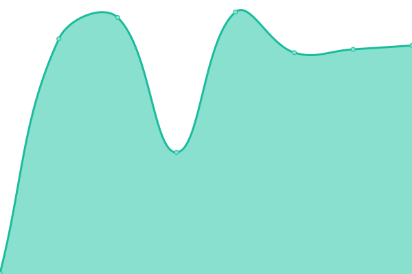
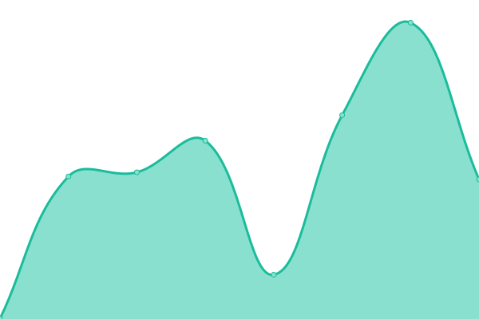
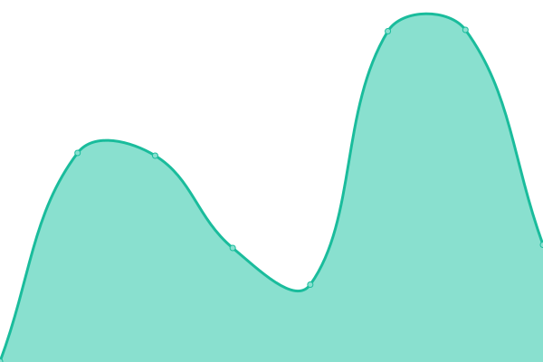

# [📈 Live Status](https://status.iuga.info): <!--live status--> **🟧 Partial outage**

This repository contains the open-source uptime monitor and status page for [University of Washington Informatics Undergraduate Association](iuga.info), powered by [Upptime](https://github.com/upptime/upptime).

With [Upptime](https://upptime.js.org), you can get your own unlimited and free uptime monitor and status page, powered entirely by a GitHub repository. We use [Issues](https://github.com/UW-IUGA/status/issues) as incident reports, [Actions](https://github.com/UW-IUGA/status/actions) as uptime monitors, and [Pages](https://status.iuga.info) for the status page.

<!--start: status pages-->
<!-- This summary is generated by Upptime (https://github.com/upptime/upptime) -->
<!-- Do not edit this manually, your changes will be overwritten -->
<!-- prettier-ignore -->
| URL | Status | History | Response Time | Uptime |
| --- | ------ | ------- | ------------- | ------ |
|  [IUGA Website](https://iuga.info) | 🟩 Up | [iuga-website.yml](https://github.com/UW-IUGA/iuga-status-app/commits/HEAD/history/iuga-website.yml) | 

 434ms
     
 | 

<a href="https://status.iuga.info/history/iuga-website">99.61%</a>
    

|  IUGA Website (Staging) | 🟩 Up | [iuga-website-staging.yml](https://github.com/UW-IUGA/iuga-status-app/commits/HEAD/history/iuga-website-staging.yml) | 

 1103ms
     
 | 

<a href="https://status.iuga.info/history/iuga-website-staging">93.24%</a>
    

|  IUGA Website (Development) | 🟩 Up | [iuga-website-development.yml](https://github.com/UW-IUGA/iuga-status-app/commits/HEAD/history/iuga-website-development.yml) | 

 547ms
     
 | 

<a href="https://status.iuga.info/history/iuga-website-development">93.24%</a>
    

|  IUGA Admin Console | 🟩 Up | [iuga-admin-console.yml](https://github.com/UW-IUGA/iuga-status-app/commits/HEAD/history/iuga-admin-console.yml) | 

 484ms
     
 | 

<a href="https://status.iuga.info/history/iuga-admin-console">100.00%</a>
    

|  IUGA Admin Console (Development) | 🟥 Down | [iuga-admin-console-development.yml](https://github.com/UW-IUGA/iuga-status-app/commits/HEAD/history/iuga-admin-console-development.yml) | 

 437ms
     
 | 

<a href="https://status.iuga.info/history/iuga-admin-console-development">52.07%</a>
    

<!--end: status pages-->

[**Visit our status website →**](https://status.iuga.info)

## 📄 License

- Powered by: [Upptime](https://github.com/upptime/upptime)
- Code: [MIT](./LICENSE) © [University of Washington Informatics Undergraduate Association](iuga.info)
- Data in the `./history` directory: [Open Database License](https://opendatacommons.org/licenses/odbl/1-0/)
